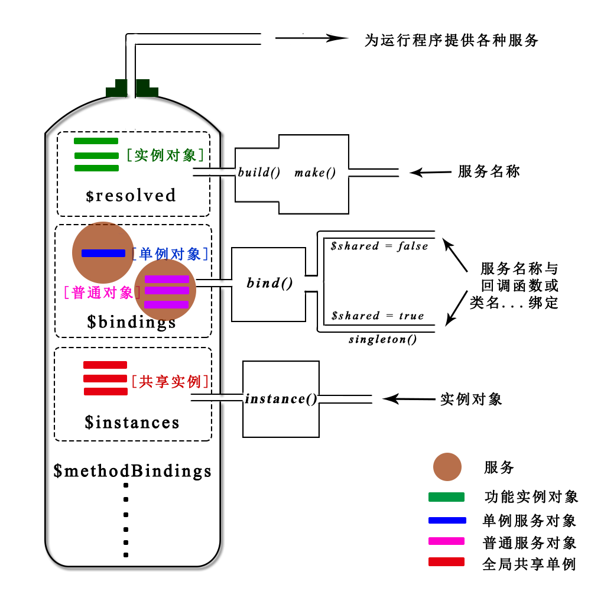

### 服务容器

“服务容器”是Lumen框架整个系统功能调度配置的核心，它提供了整个框架运行过程中的一系列服务。“服务容器”就是提供服务(服务可以理解为系统运行中需要的东西，如：对象、文件路径、系统配置等)的载体，在系统运行的过程中动态的为系统提供这些服务。下边是服务容器工作示意图:



#### 一、服务容器的产生

Lumen框架中，服务容器是由illuminate/container/Container.php中Container类完成的，该类实现了服务容器的核心功能。laravel/lumen-framework/src/Application.php中Application类继承了该类，实现了服务容器初始化配置和功能拓展。源码中生成服务容器的代码是在bootstrap/app.php中：

```
$app = new Laravel\Lumen\Application(
    dirname(__DIR__)
);
```

也就是Lumen框架在处理每一个请求的时候，都会首先为这个请求生成一个服务容器，用于容纳请求处理需要的服务。

#### 二、服务绑定

服务容器生成以后，就可以向其中添加服务,服务绑定可以理解为一个服务和一个关键字绑定,看作键值对的形式就是：一个"key" 对应一个服务。要绑定的服务不同，使用的容器中的绑定函数也不同，框架初始化时使用到的是回调函数服务绑定和实例对象服务绑定。回调函数绑定分两种：一种是普通绑定，另外一种是单例绑定，通过bind()函数中的参数$shared进行区分，项目代码中的singleton()绑定单例就是bind()函数中$shared参数为true的情况。源码如下：

```
 public function singleton($abstract, $concrete = null)
    {
        $this->bind($abstract, $concrete, true);
    }
```

单例绑定在整个Lumen生命周期中只会生成并使用一个实例对象。绑定一个实例对象到容器中使用的是instance()函数,绑定之后生成的实例对象会在$instance属性中记录。回调函数的绑定在$bindings属性中记录。

有一种情况是绑定具体类名称，实际上也是绑定回调函数的方式，只是回调函数是服务容器根据提供的参数自动生成的,下面章节我们会详细讲解。源码中有如下代码：

```
$app->singleton(
    Illuminate\Contracts\Debug\ExceptionHandler::class,
    App\Exceptions\Handler::class
);

$app->singleton(
    Illuminate\Contracts\Console\Kernel::class,
    App\Console\Kernel::class
);
```

在服务绑定过程中，尽量使用接口名称和服务进行绑定，这样可以使得一个具体的功能仅仅和接口实现了耦合，当应用需求变化时可以修改具体类，只要这个类还符合接口规范，程序依然可以健壮的运行。这种“面向接口”编程是一种新的，更有效的解决依赖的编程模式。Lumen框架的接口定义规范都放在/learnLumen/vendor/illuminate/contracts 文件夹下。

#### 三、服务解析

服务绑定到容器之后，运行程序就可以随时从容器中取出服务，这个过程称为“服务解析”。服务解析的步骤就是运行程序先获取到容器对象，然后使用容器对象解析相应的服务。服务解析有常用几种方式：

+ 使用保存服务容器成员属性，调用make函数进行解析

```
$this->app->make(App\Service\ExampleService::class);
```

+ 通过全局函数app()来获取

```
app(App\Service\ExampleService::class);
```

+ 如果程序使用了Facades外观，还可以通过静态方法来解析

```
\App::make(App\Service\ExampleService::class);
```

+ 服务容器类Container实现了ArrayAccess接口，可以使用数组的方式进行服务解析

```
app[App\Service\ExampleService::class];
```

ArrayAccess(数组式访问)接口非常有用，提供了像访问数组一样访问对象的能力的接口。

使用依赖注入的方式也可以实现服务的自动解析。即在类的构造函数中，使用相应的类提示符，容器会利用自身的反射机制自动解析依赖并实现注入。需要注意的是：在服务注册以后使用依赖注入功能，则该服务名称和服务是要遵循一定规范的。即服务名称一般为服务生成的类名称或者接口名称，只有这样当服务根据依赖限制查找到服务后生成的实例对象才能满足这个限制，否则就会报错。

并不是Lumen框架中所有的类都能实现自动依赖注入的功能,只有“服务容器”创建的类实例才能实现依赖自动注入。