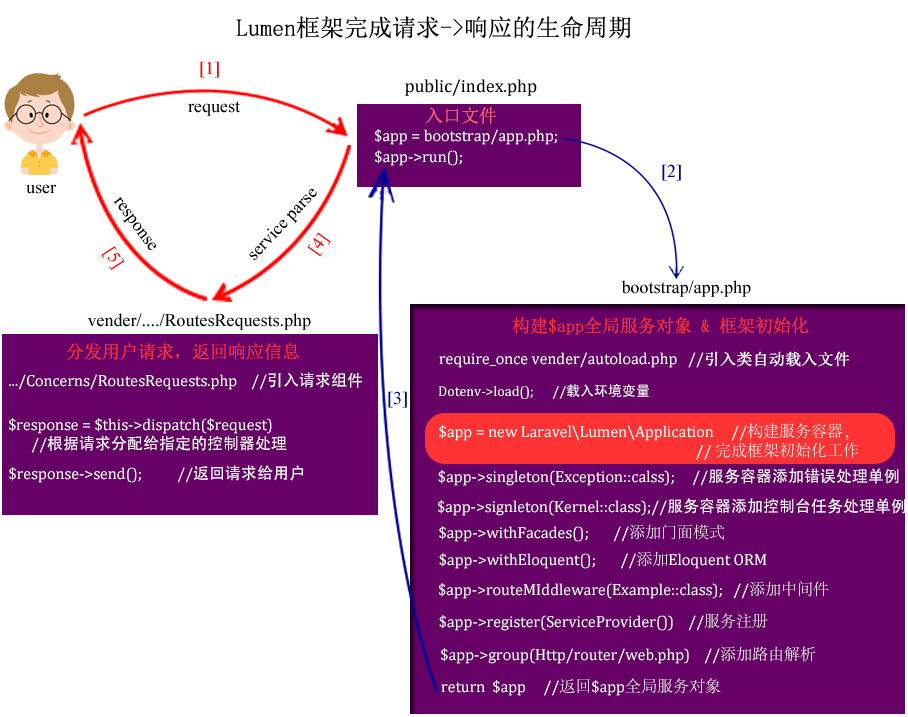

### Lumen框架的生命周期

Lumen框架的生命周期可以理解为完成一次 request -> response 的过程。可用下图简单表示，笔者将结合Lumen框架源码（**版本号：5.7.7**）做简单介绍。



1.用户发起请求，程序执行Lumen入口脚本文件 public/index.php:
  + 手动加载 bootstrap/app.php: 

  ```
    $app = require __DIR__.'/../bootstrap/app.php';
  ```
  
2.接下来程序加载执行 bootstrap/app.php ,这个过程完成了框架初始化的所有工作:
  + 手动加载类自动载入文件：

  ```
    require_once __DIR__ . '/../vendor/autoload.php';
  ```
  Lumen框架使用Composer工具管理依赖，根据php的命名空间和SPL(Standard PHP Library)中类自动载入(主要由spl_autoload_register函数实现)特性，结合psr相关规范实现程序运行过程中自动加载使用到的脚本文件(具体实现原理将在“单一入口实现”章节详细介绍)。
  + 加载环境变量配置

  ```
    try {
    (new Dotenv\Dotenv(dirname(__DIR__)))->load();
    } catch (Dotenv\Exception\InvalidPathException $e) {
    //
    }
  ```
  + 构建容器对象 $app
  ```
    $app = new Laravel\Lumen\Application(
    dirname(__DIR__)
    );
  ```

  Lumen框架中使用全局服务容器解决实现程序中的依赖注入问题，“服务容器”的实现是框架最核心的部分，也是源码中难以理解的部分。（具体实现将在“服务容器”章节详细讲解）

  + 启动Facades特性(默认关闭):

  ```
    $app->withFacades();
  ```

  + 启用Eloquent特性(默认关闭):

  ```
    $app->withEloquent();
  ```

  + 添加程序使用到的错误处理和核心类库单例

  ```
  $app->singleton(
    Illuminate\Contracts\Debug\ExceptionHandler::class,
    App\Exceptions\Handler::class
    );

    $app->singleton(
    Illuminate\Contracts\Console\Kernel::class,
    App\Console\Kernel::class
    );
  ```

  + 为请求路由添加中间件（默认关闭）

  ```
    $app->middleware([
    App\Http\Middleware\ExampleMiddleware::class
    ]);
  ```

  + 注册外部服务 (默认关闭)

  ```
    $app->register(App\Providers\AppServiceProvider::class);
  ```
  Lumen很大一部分特性是依赖ServiceProvider（服务注册）来完成的。

  + 加载执行路由解析文件

  ```
    $app->router->group([
    'namespace' => 'App\Http\Controllers',
    ], function ($router) {
    require __DIR__ . '/../routes/web.php';
    });
  ```

  + 返回服务容器 $app

  ```
   return $app;
  ```

3.启动容器,根据路由分发请求到相应的处理程序，返回响应结果给用户
  + 启动容器

  ```
    $app->run();
  ```

  + 分发请求到相应的处理程序，返回响应给用户

  ```
    public function run($request = null)
    {
        $response = $this->dispatch($request);

        if ($response instanceof SymfonyResponse) {
            $response->send();
        } else {
            echo (string)$response;
        }

        if (count($this->middleware) > 0) {
            $this->callTerminableMiddleware($response);
        }
    }
  ```