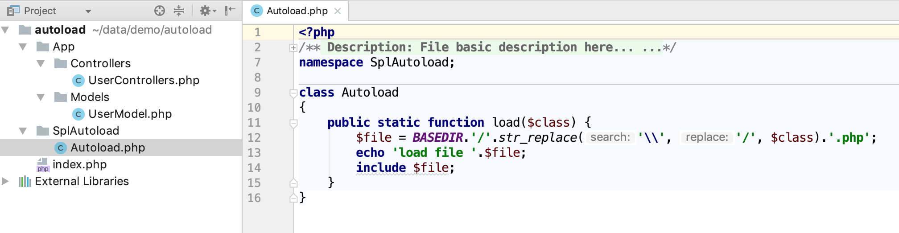
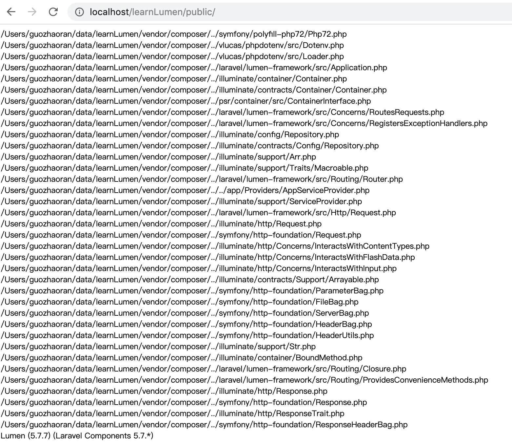

### 实现单一入口
几乎所有的php框架都实现了单一入口的功能，并且在代码当中，也不需要用户手动的 include/require 要执行的脚本文件。这是怎样做到的呢？下面笔者就使用一个小demo结合Lumen的源码来详细讲解php框架单一入口功能的实现原理。下面先展示小demo的目录结构:



“单一入口”主要是使用命名空间，代码文件符合psr相关规范，结合SPL的spl_autoload_register函数实现的。lumen框架使用composer包管理工具管理依赖，符合psr-4规范。

> PSR 是 PHP Standard Recommendations 的简写，由 PHP FIG 组织制定的 PHP 规范，是 PHP 框架开发的实践标准。

我们的demo主要结合psr-0规范,psr-0主要有以下三项约定:

+ php的命名空间必须与绝对路径一致
+ 类名的首字母必须大写
+ 除入口文件外，其它的.php文件必须只有一个类

> psr-4在psr-0基础上做了一些改进，例如：PSR-0中对下划线(_)是有特殊的处理的，下划线会转换成DIRECTORY_SEPARATOR，这是出于对PHP5.3以前版本兼容的考虑，而PSR-4中是没有这个处理的。此外，PSR-4要求在autoloader中不允许抛出exceptions以及引发任何级别的errors，也不应该有返回值。这是因为可能注册了多个autoloaders，如果一个autoloader没有找到对应的class，应该交给下一个来处理，而不是去阻断这个通道。这也是两者比较大的一个区别。PSR-4更简洁更灵活了，但这使得它相对更复杂了。例如通过完全符合PSR-0标准的class name，通常可以明确的知道这个class的路径，而PSR-4可能就不是这样了。

开发一个符合PSR-0规范的框架很简单，只要满足下面三个条件就可以了：

    1.全部使用命名空间
    2.php类库文件自动载入，不能有include/require
    3.保证有单一入口

下面是入口文件index.php中的代码：

```
<?php
    define('BASEDIR',__DIR__);
    include_once BASEDIR.'/SplAutoload/Autoload.php';
    spl_autoload_register('\\SplAutoload\\Autoload::load');

    (new APP\Controllers\UserControllers())->showMsg();
```

首先定义一个基本路径常量BASEDIR，然后手动引入自动载入函数所在的脚本文件。使用spl_autoload_register函数注册自动载入函数就实现了类自动载入的功能，我们再来看一下自动载入函数的代码：

```
<?php
    namespace SplAutoload;

    class Autoload
    {
        public static function load($class) {
            $file = BASEDIR.'/'.str_replace('\\', '/', $class).'.php';
            echo 'load file '.$file;
            include $file;
        }
    }
```

自动载入函数中的$class是一个带有命名空间路径和类名的字符串。这也是psr-0规范中为什么明确规定：php的命名空间必须与绝对路径一致的意义所在：根据$class就可以确定要引入文件的路径和名称（注意命名空间中的'\\'和文件路径中的'/'的区别，故使用str_replace作替换）。

实现了类自动载入功能以后就可以实现单一入口了，例如要调用(new APP\Controllers\UserControllers())->showMsg()方法，就无需手动再引入UserControllers.php文件了。注意UserControllers.php的代码也要符合psr-0的规范:

```
<?php
    namespace App\Controllers;

    use App\Models\UserModel;

    class UserControllers
    {
        protected $user = null;
        public function __construct()
        {
            $this->user = new UserModel();
        }

        public function showMsg()
        {
            echo 'hello, i am '.$this->user->getName();
        }
    }
```

至此，我们已经实现了一个简单的单一入口的小例子。但是麻雀虽小，五脏俱全，Lumen框架实现单一入口和类自动载入的功能原理和我们的小例子是一样的。我们从bootstrap/app.php 源码开始看：

```
<?php
    require_once __DIR__ . '/../vendor/autoload.php';
```

然后我们再打开autoload.php，源码如下：

```
<?php

    // autoload.php @generated by Composer

    require_once __DIR__ . '/composer/autoload_real.php';

    return ComposerAutoloaderInited7c597af0da800ba0d5e77d002b87cc::getLoader();
```

看样子重要的代码在autoload_real.php中实现了，我们浏览autoload_real.php中的源码：

```
<?php

    // autoload_real.php @generated by Composer

    class ComposerAutoloaderInited7c597af0da800ba0d5e77d002b87cc
    {
        private static $loader;

        public static function loadClassLoader($class)
        {
            if ('Composer\Autoload\ClassLoader' === $class) {
                require __DIR__ . '/ClassLoader.php';
            }
        }

        public static function getLoader()
        {
            if (null !== self::$loader) {
                return self::$loader;
            }

            spl_autoload_register(array('ComposerAutoloaderInited7c597af0da800ba0d5e77d002b87cc', 'loadClassLoader'), true, true);
            self::$loader = $loader = new \Composer\Autoload\ClassLoader();
            spl_autoload_unregister(array('ComposerAutoloaderInited7c597af0da800ba0d5e77d002b87cc', 'loadClassLoader'));

            ......

            $loader->register(true);

            ......

            return $loader;
        }
    }
```

可以看出，代码主要调用了\Composer\Autoload\ClassLoader()中的register方法,源码就是例如spl_autoload_register注册了自动载入函数:

```
    /**
     * Registers this instance as an autoloader.
     *
     * @param bool $prepend Whether to prepend the autoloader or not
     */
    public function register($prepend = false)
    {
        spl_autoload_register(array($this, 'loadClass'), true, $prepend);
    }
```

我们再来看loadClass函数主要做了哪些工作：

```
    /**
     * Loads the given class or interface.
     *
     * @param  string    $class The name of the class
     * @return bool|null True if loaded, null otherwise
     */
    public function loadClass($class)
    {
        if ($file = $this->findFile($class)) {
            includeFile($file);

            return true;
        }
    }
```

loadClass函数所做的工作和我们小例子中做的工作一样，都是根据$class这个带有命名空间和类名信息的参数加载要使用到的脚本文件。我们在源码中includeFile函数里输出Lumen框架执行一个最简单的路由所加载的文件信息，代码如下：

```
    /**
    * Scope isolated include.
    *
    * Prevents access to $this/self from included files.
    */
    function includeFile($file)
    {
        echo $files . '<br/>';
        include $file;
    }
```

访问入口脚本文件，打印信息如下图所示：



可以看到执行一个最简单的GET请求,lumen框架就要引入执行如此多的脚本文件，这些脚本文件中有处理请求的，有处理错误逻辑的，有提供解析服务的，还有发送响应数据的等等。那么这些脚本文件之间的依赖关系是怎样解决的呢?Lumen框架处理请求能力如此强悍,启动框架又仅需要几毫秒的时间，它又是怎样做到的呢？探索这些问题都是学习Lumen源码的动力。

简单总结一下本节知识点：

+ php开发框架需要遵循psr规范的相关标准
+ spl_autoload_register可以注册自动载入函数实现代码文件的自动载入
