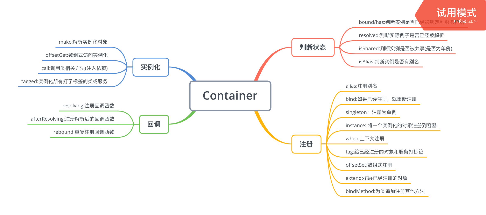

### 源码解析

对于lumen框架来讲,服务容器相当于发动机，绑定与解析框架启动和运行生命周期中所有的服务。它的大致架构如下所示:



#### 一、服务容器绑定的方法
- bind绑定
- bindif绑定
- singleton绑定
- instance绑定
- context绑定
- 数组绑定
- 标签绑定
- extend拓展
- Rebounds与Rebinding

源码中bind实现代码如下：

```
public function bind($abstract, $concrete = null, $shared = false)
    {
        $this->dropStaleInstances($abstract);

        if (is_null($concrete)) {
            $concrete = $abstract;
        }

        if (! $concrete instanceof Closure) {
            $concrete = $this->getClosure($abstract, $concrete);
        }

        $this->bindings[$abstract] = compact('concrete', 'shared');

        if ($this->resolved($abstract)) {
            $this->rebound($abstract);
        }
    }
```

从源码中我们可知:使用bind方法绑定服务，每次都会重新进行绑定(删除原来的绑定，再重新绑定)。我们类比服务容器中服务的绑定为KV健值对。key为接口名称，而value为具体的服务实现，之所以推荐使用接口名称作为key，是因为只要开发者遵循相关的接口约束规范，就可以对服务进行拓展和改进，这也是面向接口编程比较新颖之处。另外我们可以看到bind方法核心实现方法是调用rebound方法。

bindif方法核心是调用bind方法，只不过对容器是否绑定服务做了一个判断:

```
public function bindIf($abstract, $concrete = null, $shared = false)
    {
        if (! $this->bound($abstract)) {
            $this->bind($abstract, $concrete, $shared);
        }
    }
```

sington是bind方法的一种特例，shared=true表示为单例绑定:

```
 public function singleton($abstract, $concrete = null)
    {
        $this->bind($abstract, $concrete, true);
    }
```

instance是绑定对象实例到容器中(不用使用make进行解析了):

```
public function instance($abstract, $instance)
    {
        $this->removeAbstractAlias($abstract);

        $isBound = $this->bound($abstract);

        unset($this->aliases[$abstract]);

        $this->instances[$abstract] = $instance;

        if ($isBound) {
            $this->rebound($abstract);
        }

        return $instance;
    }
```

数组绑定是Container类继承了ArrayAccess接口，在offsetSet中调用了bind方法进行注册：

```
public function offsetSet($key, $value)
    {
        $this->bind($key, $value instanceof Closure ? $value : function () use ($value) {
            return $value;
        });
    }
```

extend方法实现了当原来的类注册或者实例化出来后，对其进行拓展：

```
public function extend($abstract, Closure $closure)
    {
        $abstract = $this->getAlias($abstract);

        if (isset($this->instances[$abstract])) {
            $this->instances[$abstract] = $closure($this->instances[$abstract], $this);

            $this->rebound($abstract);
        } else {
            $this->extenders[$abstract][] = $closure;

            if ($this->resolved($abstract)) {
                $this->rebound($abstract);
            }
        }
    }
```

Context绑定是针对于两个类使用同一个接口，但是我们在类中注入了不同的实现，这时候我们就需要使用when方法了:

```
 public function when($concrete)
    {
        $aliases = [];

        foreach (Arr::wrap($concrete) as $c) {
            $aliases[] = $this->getAlias($c);
        }

        return new ContextualBindingBuilder($this, $aliases);
    }
```

继续看ContextualBindingBuilder类的源码我们知道，上下文绑定的基本思路就是$this->app->when()->needs()->give();
比如有几个控制器分别依赖IlluminateContractsFilesystemFilesystem的不同实现:

```
$this->app->when(StorageController::class)
          ->needs(Filesystem::class)
          ->give(function () {
            Storage::class
          });//提供类名

$this->app->when(PhotoController::class)
          ->needs(Filesystem::class)
          ->give(function () {
             return new Storage();
          });//提供实现方式

$this->app->when(VideoController::class)
          ->needs(Filesystem::class)
          ->give(function () {
            return new Storage($app->make(Disk::class));
          });//需要依赖注入
```

有一些场景，我们希望当接口改变以后对已实例化的对象重新做一些改变，这就是rebinding 函数的用途：

```
  public function rebinding($abstract, Closure $callback)
    {
        $this->reboundCallbacks[$abstract = $this->getAlias($abstract)][] = $callback;

        if ($this->bound($abstract)) {
            return $this->make($abstract);
        }
    }
```

#### 二、服务别名

在服务容器解析之前，Lumen框架会将常用的服务起一些别名，方便系统Facade方法调用和解析。

```
public function withAliases($userAliases = [])
    {
        $defaults = [
            'Illuminate\Support\Facades\Auth' => 'Auth',
            'Illuminate\Support\Facades\Cache' => 'Cache',
            'Illuminate\Support\Facades\DB' => 'DB',
            'Illuminate\Support\Facades\Event' => 'Event',
            'Illuminate\Support\Facades\Gate' => 'Gate',
            'Illuminate\Support\Facades\Log' => 'Log',
            'Illuminate\Support\Facades\Queue' => 'Queue',
            'Illuminate\Support\Facades\Route' => 'Route',
            'Illuminate\Support\Facades\Schema' => 'Schema',
            'Illuminate\Support\Facades\Storage' => 'Storage',
            'Illuminate\Support\Facades\URL' => 'URL',
            'Illuminate\Support\Facades\Validator' => 'Validator',
        ];

        if (! static::$aliasesRegistered) {
            static::$aliasesRegistered = true;

            $merged = array_merge($defaults, $userAliases);

            foreach ($merged as $original => $alias) {
                class_alias($original, $alias);
            }
        }
    }
    ...
    protected function registerContainerAliases()
    {
        $this->aliases = [
            'Illuminate\Contracts\Foundation\Application' => 'app',
            'Illuminate\Contracts\Auth\Factory' => 'auth',
            'Illuminate\Contracts\Auth\Guard' => 'auth.driver',
            'Illuminate\Contracts\Cache\Factory' => 'cache',
            'Illuminate\Contracts\Cache\Repository' => 'cache.store',
            'Illuminate\Contracts\Config\Repository' => 'config',
            'Illuminate\Container\Container' => 'app',
            'Illuminate\Contracts\Container\Container' => 'app',
            'Illuminate\Database\ConnectionResolverInterface' => 'db',
            'Illuminate\Database\DatabaseManager' => 'db',
            'Illuminate\Contracts\Encryption\Encrypter' => 'encrypter',
            'Illuminate\Contracts\Events\Dispatcher' => 'events',
            'Illuminate\Contracts\Hashing\Hasher' => 'hash',
            'log' => 'Psr\Log\LoggerInterface',
            'Illuminate\Contracts\Queue\Factory' => 'queue',
            'Illuminate\Contracts\Queue\Queue' => 'queue.connection',
            'request' => 'Illuminate\Http\Request',
            'Laravel\Lumen\Routing\Router' => 'router',
            'Illuminate\Contracts\Translation\Translator' => 'translator',
            'Laravel\Lumen\Routing\UrlGenerator' => 'url',
            'Illuminate\Contracts\Validation\Factory' => 'validator',
            'Illuminate\Contracts\View\Factory' => 'view',
        ];
    }
    ......
```

lumen服务容器中通过alias方法添加服务别名:

```
    public function alias($abstract, $alias)
    {
        $this->aliases[$alias] = $abstract;

        $this->abstractAliases[$abstract][] = $alias;
    }
```

通过getAlias获得服务的别名：

```
public function getAlias($abstract)
    {
        if (! isset($this->aliases[$abstract])) {
            return $abstract;
        }

        if ($this->aliases[$abstract] === $abstract) {
            throw new LogicException("[{$abstract}] is aliased to itself.");
        }

        return $this->getAlias($this->aliases[$abstract]);
```

通过getAlias我们知道，服务别名是支持递归设置的。

#### 三、其他函数简述

服务容器解析一个对象时会触发resolving和afterResolving函数。分别在之前之后触发:

```
public function resolving($abstract, Closure $callback = null)
    {
        if (is_string($abstract)) {
            $abstract = $this->getAlias($abstract);
        }

        if (is_null($callback) && $abstract instanceof Closure) {
            $this->globalResolvingCallbacks[] = $abstract;
        } else {
            $this->resolvingCallbacks[$abstract][] = $callback;
        }
    }

    public function afterResolving($abstract, Closure $callback = null)
    {
        if (is_string($abstract)) {
            $abstract = $this->getAlias($abstract);
        }

        if ($abstract instanceof Closure && is_null($callback)) {
            $this->globalAfterResolvingCallbacks[] = $abstract;
        } else {
            $this->afterResolvingCallbacks[$abstract][] = $callback;
        }
    }
```

服务容器中有一些装饰函数，wrap装饰call,factory装饰make:

```
public function call($callback, array $parameters = [], $defaultMethod = null)
    {
        return BoundMethod::call($this, $callback, $parameters, $defaultMethod);
    }

......

public function wrap(Closure $callback, array $parameters = [])
    {
        return function () use ($callback, $parameters) {
            return $this->call($callback, $parameters);
        };
    }
```

服务容器的解析方法和函数之前已经说过，有几种常用的方法，这里就不再一一赘述了。

可以服务容器中flush()方法用于清空容器中所有的服务：

```
  public function flush()
    {
        $this->aliases = [];
        $this->resolved = [];
        $this->bindings = [];
        $this->instances = [];
        $this->abstractAliases = [];
    }
```

Lumen中的服务容器源码实现非常复杂，但是对其工作原理了解清楚之后,看起来也就有些头绪了，每个函数所做的工作也可以结合注释和源码进行理解了。