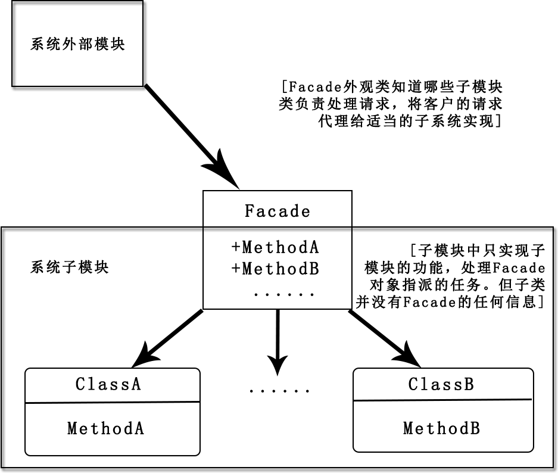

### 外观模式

外观模式(Facade Pattern):为系统中复杂的子模块提供一组高层接口,使得子模块更加容易使用。

在一个框架中,往往一个子功能会非常的复杂，提供一个外观模式可以向外界提供简单的调用方法。这样不仅隐藏了调用对象的复杂性，也可以使得调用对象更容易拓展维护。



比如一个User类，里边有getUserMsg获取用户信息的接口。在使用getUser这个接口的时候，需要设置用户的用户名和用户年龄等信息。所以正常情况下，调用getUserMsg方法需要设置用户信息，这个过程如果非常复杂的话，对于使用的用户来说将是非常困难的事情。

如果设计一个UserFacade，里边存在一个静态方法getUserCall,这个方法可以直接设置用户信息并调用getUserMsg方法。就会使用户的操作简单许多:

```
class User {
    protected $userName;
    protected $userAge;

    //设置用户姓名
    public function setUserName($userName)
    {
        return $this->userName = $userName;
    }

    //设置用户年龄
    public function setUserAge($userAge)
    {
        return $this->userAge = $userAge;
    }
    
    //获取用户信息
    public function getUserMsg()
    {
        echo 'user name is:'.$this->userName.'; and user age is:'.$this->userAge;
    }
}

class UserFacade {
    public static function getUserCall($userInfo) {
        $user = new User();
        $user->setUserName($userInfo['username']);
        $user->setUserAge($userInfo['age']);
        return $user->getUserMsg();
    }
}

$userInfo = ['username' => 'guozhaoran', 'age' => 24];

UserFacade::getUserCall($userInfo);
```
