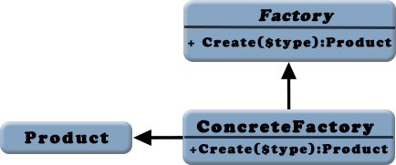

### 工厂模式

工厂模式(Factory pattern)和单例模式一样，是另外一种创建型模式。和单例模式不同的是，单例模式会创建和管理一个单独的类型的单一对象，工厂模式则可能被用于创建多种不同类型的类的多个对象。

当程序编写的时候，并不能确定在生成对象的时候其确切的对象类型，只有到程序运行的时候才会确定。在动态的应用程序中，这种情况非常常见，这种场景下工厂模式比较有用。

还有一种情况比较适合使用工厂模式：有一个抽象的基类，它的几个不同的派生子类需要立即被创建。我们一旦创建了一个对象，对这个对象的使用就会与期望中保持一致，而不用关心它的确切类型。

工厂模式通过一个静态方法来实现，一般情况下该方法被命名为Create()、factory()、factoryMethod()或者createInstance()。这个方法至少接收一个参数，用于标示将要创建的对象的类型。这个方法将会返回该类型的一个对象。



假如我们有三个形状类:Rectangle(长方形)、Triangle(三角形)、Circle(圆形)。它们有各自的类，但是接受不同的参数，长方形接受参数为长、宽；三角形分别接受三条边长；圆形则只接收半径。我们现在要创建一个工厂，根据传入不同的参数，分别生产相应的形状类:

```
abstract class ShapeFacroty
{
    static function Create($type, array $sizes){
        //根据接收到的参数确定要生产的对象
        switch ($type) {
            case 'rectangle':
                return new Rectangle($sizes[0], $sizes[1]);
                break;
            case 'triangle':
                return new Triangle($sizes[0], $sizes[1], $sizes[2]);
                break;
            case 'circle':
                return new Circle($sizes[0]);
                break;
        }
    }
}
```

工厂模式可以很容易的拓展，假如要增加其他多边形类。使用工厂模式的结论是，由于它的内部验证，使得工厂类和应用程序的其他部分紧密耦合在一起，我们可以看看ShapeFactory类的Create方法，它会假设传进一个$sizes数组。

一个工厂模式的变种是抽象工厂模式.然而工厂模式输出不同的对象，每一个都继承自同一个父类，抽象工厂则输出这些工厂类。