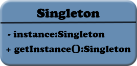

### 单例模式

单例模式(singleton pattern)是一种创建型模式,它会限制应用程序，使其只能创建一特定类型的一个单一的实例。例如：一个Web站点将会需要一个数据库连接对象，但是应该有且只能有一个。

单例模式很容易实现,可以使用一个静态属性来保证对于一个特定的类来说只存在一个单一的实例。

```
class SomeClass {
    static private $instance = null;
}
```

因为属性是静态的，所以它会被所有的类所共享。我们只要将一个对象或者属性赋给它，然后所有对这个类的引用都可以使用它。



我们要创建一个方法:getInstance()，在类的实例不存在时，该方法将会创建一个类的实例，并返回这个实例。

```
static function getInstance(){
    if(self::$instance == null){
       self::$instance = new SomeClass();
    }

    return self::$instance;
}
```

下边是一个完整的实例:

```
<?php
class Config{
    //存储当前类的一个单例
    static private $instance = null;
    
    //存储设置信息
    private $settings = [];

    //设置对象构造方法和__clone魔术方法为私有，防止对其进行修改
    private function __construct() {}
    private function __clone() {}

    //获取单例的方法
    static function getInstance(){
        if(self::$instance == null){
            self::$instance = new Config();
    }

        return self::$instance;
    }

    //设置存储信息的方法
    public function set($index, $value)
    {
       $this->settings[$index] = $value;
    }

    //获得存储信息的方法
    public function get($index)
    {
        return $this->settings[$index];
    }
}
```

当第二个对象调用这段代码时就会返回一个实例：

```
$obj1 = Config::getInstance();
$obj2 = Config::getInstance();
```

$obj1 和 $obj2都指向了Config的同一个实例。如果用户试图使用new或者clone去创建这个类的一个新对象，那么将会得到多个实例，这就破坏了单例模式的限制。为了防止这种情况发生，应该创建私有的构造函数和__clone魔术方法。

使用单例模式比较好的场景是创建一个全局对象，比如用于整个站点的配置对象、数据库的连接等等。